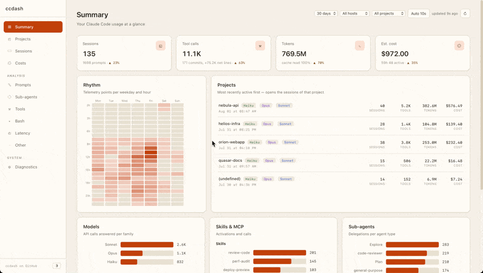

# ccdash


[](https://github.com/dumontchristophe/ccdash/actions/workflows/ci.yml)


**Claude Code telemetry, on your own machine.** See what your sessions actually
do: which tools run and fail, what gets delegated to sub-agents, where the
latency and the tokens go — no dependency, nothing to install, no outbound call.

> **Run it on your own machine, not on a public server.** ccdash has no
> authentication: anyone who can reach the port reads every prompt and every
> shell command it has stored. It binds `127.0.0.1` by default. Read
> [`SECURITY.md`](SECURITY.md) before you install it.



## Contents

- [How it works](#how-it-works)
- [Why it is built this way](#why-it-is-built-this-way)
- [Quick start](#quick-start)
- [Documentation](#documentation)
- [Reporting issues](#reporting-issues)
- [License](#license)

## How it works

Claude Code measures itself — tool durations, tokens, delegations, hook fires —
and exports it as OpenTelemetry metrics and logs. ccdash listens for that stream
over OTLP/HTTP on port `4318`, stores it in SQLite and serves the dashboard on
the same port.

```
Claude Code  ──OTLP/HTTP (json)──▶  ccdash :4318  ──▶  ccdash.db (SQLite)
                                          │
                                          └──▶  Dashboard http://…:4318/
```

**It reads the stream, not your session files.** ccdash never opens `~/.claude`
and reconstructs nothing from transcripts, so it is **not retroactive**: the
dashboard fills from the first session you run after enabling telemetry.

## Why it is built this way

Three constraints, held on purpose:

- **No dependency** — Python stdlib, ES modules served as written. Nothing to
  install, no supply chain to audit. A PR adding a runtime package is refused
  ([`CONTRIBUTING.md`](CONTRIBUTING.md)).
- **Local** — no outbound call from the server, nothing fetched by the page.
  Your telemetry stays on your disk.
- **Simple to start** — clone and run, then an `env` block in Claude Code's
  `settings.json`. One SQLite file, no account.

## Quick start

### Docker (recommended)

Download the compose file and start it — it pulls the published image, no build
from source:

```bash
curl -O https://raw.githubusercontent.com/dumontchristophe/ccdash/main/compose.yml
docker compose up -d
```

<details>
<summary><b>Python from source</b></summary>

```bash
git clone https://github.com/dumontchristophe/ccdash.git
cd ccdash
python3 -m ccdash
```

</details>


ccdash listens on `http://127.0.0.1:4318`.


### Claude Code Configuration

add this `env` block to your global `~/.claude/settings.json` and restart your session.

```json
{
  "env": {
    "CLAUDE_CODE_ENABLE_TELEMETRY": "1",
    "OTEL_METRICS_EXPORTER": "otlp",
    "OTEL_METRICS_INCLUDE_ACCOUNT_UUID": "false",
    "OTEL_EXPORTER_OTLP_PROTOCOL": "http/json",
    "OTEL_EXPORTER_OTLP_ENDPOINT": "http://127.0.0.1:4318",
    "OTEL_EXPORTER_OTLP_METRICS_TEMPORALITY_PREFERENCE": "delta",
    "OTEL_LOGS_EXPORTER": "otlp",
    "OTEL_LOG_TOOL_DETAILS": "1",
    "OTEL_LOG_USER_PROMPTS": "0",
    "OTEL_LOG_ASSISTANT_RESPONSES": "0",
    "OTEL_RESOURCE_ATTRIBUTES": "host=my-host" 
  }
}
```

add this `env` block **to your project repository** `.claude/settings.json` or `.claude/settings.local.json`

```json
{ 
  "env": { 
    "OTEL_RESOURCE_ATTRIBUTES": "host=my-host,project=my-project" 
  } 
}
```

These variables decide what the dashboard can show:

| Variable | What it records | Default |
|---|---|---|
| `OTEL_LOG_TOOL_DETAILS` | The full Bash command run, each sub-agent's type and description, and MCP server names. Off, these columns read empty. | `1` in the block above |
| `OTEL_LOG_USER_PROMPTS` | Session titles and the prompt text on the Prompts tab — **stored in clear text** in `ccdash.db`. Off, sessions show by ID and prompts read `(redacted)`. | `0` (off) |
| `OTEL_LOG_ASSISTANT_RESPONSES` | Claude's answers on the session timeline and in the event inspector (clipped) — **stored in clear text**. Off, the timeline shows the turn without its text. | `0` (off) |
| `OTEL_RESOURCE_ATTRIBUTES` | Tags each session with a `host` and `project`, so the Host and Project filters can split your telemetry by machine and repository. | — |

The full variable list is in [`docs/reference.md`](docs/reference.md).

---

<details>
<summary><b>Running on a remote host</b></summary>

You can keep ccdash on another machine you own — a homelab box on your local
network.

**NOT A PUBLIC SERVER:** it has no authentication, so whoever
reaches the port reads every stored prompt and command.

Two settings, two jobs:

- **Bind** (`CCDASH_BIND` / `--host`) — the address it *listens on*. Use the
  host's private IP, not `127.0.0.1` (its own machine only) or `0.0.0.0`.

- **Allow-host** (`CCDASH_ALLOW_HOST` / `--allow-host`) — the `Host:` headers it
  *answers*; anything else gets a `403` (a guard against DNS rebinding). List
  whatever Claude Code aims at in `OTEL_EXPORTER_OTLP_ENDPOINT`, be it an IP or a
  hostname: `http://192.168.1.10:4318` → `192.168.1.10`,
  `http://ccdash.home:4318` → `ccdash.home`. Several are comma-separated.

**Docker** — in a `.env` next to your `compose.yml`:

```
CCDASH_BIND=<private IP>        # host-side address to publish on, never 0.0.0.0
CCDASH_ALLOW_HOST=<IP>,<name>   # every address and name the exporter uses
```

**Python** — `python3 -m ccdash --host <IP> --allow-host <IP> --allow-host <name>`

Then point the exporter at it: `OTEL_EXPORTER_OTLP_ENDPOINT` = `http://<IP>:4318`
in the `env` block above.

</details>

---

## Agent skill

`skills/ccdash/` is a Claude Code skill that reads this API and turns a run into
next-run improvements: `analyse` a session or window, `recap` what was worked
on, or `ask` a one-off question. Point it at your dashboard and invoke `/ccdash`.

## Documentation

| | |
|---|---|
| The views, one by one | [`docs/dashboard.md`](docs/dashboard.md) |
| Backend: ingestion, storage, the API | [`docs/backend.md`](docs/backend.md) |
| Frontend: modules, routing, rendering | [`docs/frontend.md`](docs/frontend.md) |
| Cost semantics and the OTEL variables | [`docs/reference.md`](docs/reference.md) |
| What is stored, the threat model, how to report | [`SECURITY.md`](SECURITY.md) |
| Contributing | [`CONTRIBUTING.md`](CONTRIBUTING.md) |

## Reporting issues

Found a bug or want a feature? Open an issue with the **Bug report** or
**Feature request** template. For anything security-related, use the private
advisory link rather than a public issue — details in
[`CONTRIBUTING.md`](CONTRIBUTING.md) and [`SECURITY.md`](SECURITY.md).

## License

MIT — see [LICENSE](LICENSE).
